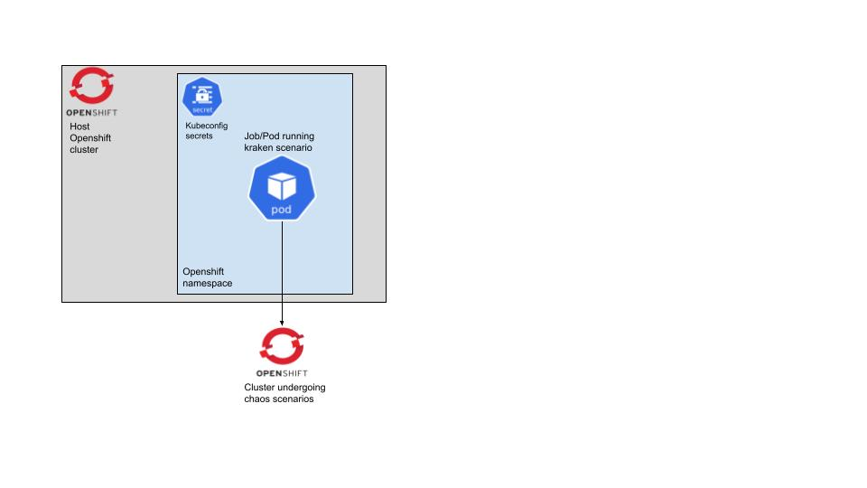

# kraken-deploy
This repository contains manifests of running kraken as a service in kubernetes/openshift. Refer to this readme on how to get started with kraken. More information about kraken can be found at https://github.com/redhat-chaos/krkn.

## Getting Started with Kraken
* Kraken can be run in multiple ways on a standalone container using podman, from openshift. 
* In this example we will be running kraken from **openshift** and <u>targeting</u> a *<u>different openshift cluster</u>* to inject chaos into. kraken scenario will run as a pod and target a different openshift cluster as shown in the image below




# Running Kraken
>  Prerequisites: You need 2 clusters, a host cluster to run kraken on and a tagrget cluster to inject chaos into.
>
> Make sure you are cluster-admin on both of the clusters

### Variables

```shell
# target
TARGET_NS=rfelix-tmp
TARGET_POD_SELECTOR='{deployment: httpd}'
TARGET_DURATION_IN_SECONDS='120'

# host_cluster
HOST_KRAKEN_NS=redhat-rfelix-kraken
```

Clone git repository

```shell
cd kraken-scenarios
# Login to the target cluster and get the kubeconfig, make sure you are cluster-admin on the target cluster
oc login $target_cluster
oc login --token=$(oc whoami -t) --server=$(oc whoami --show-server) --kubeconfig config

# Login to the host cluster create a new project
oc login $host_cluster
oc new-project $HOST_KRAKEN_NS

### Create the kube-config (that is required by kraken) from the target-cluster
oc create configmap kube-config --from-file=config
### Create a new servieaccount and give it privileges to run as a privileged container
oc create sa useroot
oc adm policy add-scc-to-user privileged -z useroot
```

Now we identify and edit the scenario we want to run and apply the job, in this eg we are running pod disruption scenario, to kill an etcd pod.

```shell
cat <<EOF > kraken-app-outage.yaml
---
apiVersion: batch/v1
kind: Job
metadata:
  name: kraken-app-outage
spec:
  selector: {}
  template:
    metadata:
      name: kraken
    spec:
      serviceAccountName: useroot
      volumes:
      - name: config
        configMap:
          name: kube-config
      containers:
        - name: kraken-runtime
          serviceAccount: useroot
          image: quay.io/chaos-kubox/krkn-hub:application-outages
          imagePullPolicy: IfNotPresent
          env:
            - name: NAMESPACE
              value: ${TARGET_NS}
            - name: POD_SELECTOR
              value: "${TARGET_POD_SELECTOR}"
            - name: DURATION
              value: "${TARGET_DURATION_IN_SECONDS}"
            - name: WAIT_DURATION
              value: "15"
            - name: BLOCK_TRAFFIC_TYPE
              value: "[Ingress]"
            - name: CERBERUS_ENABLED
              value: "False"
          volumeMounts:
            - name: config
              mountPath: /root/.kube
          securityContext:
            privileged: true
      restartPolicy: Never
EOF
```
Apply the scenario in your namespace on the host cluster
```shell
$ oc create -f kraken-app-outage.yaml
```

This will create a pod, monitor that logs and see how kraken disrupts the pod on the target cluster.

```shell
$ oc get pods
NAME                      READY   STATUS    RESTARTS   AGE
kraken-app-outage-k6cqz   1/1     Running   0          3s

$ oc logs -f $(oc get pod -o name -l job-name=kraken-app-outage)
+ source /root/main_env.sh
++ export CERBERUS_ENABLED=False
++ CERBERUS_ENABLED=False
++ export CERBERUS_URL=http://0.0.0.0:8080
++ CERBERUS_URL=http://0.0.0.0:8080
++ export WAIT_DURATION=15
++ WAIT_DURATION=15
++ export ITERATIONS=1
++ ITERATIONS=1
++ export DAEMON_MODE=False
++ DAEMON_MODE=False
++ export RETRY_WAIT=120
++ RETRY_WAIT=120
++ export PUBLISH_KRAKEN_STATUS=False
++ PUBLISH_KRAKEN_STATUS=False
++ export PORT=8081
++ PORT=8081
++ export LITMUS_VERSION=v1.13.8
++ LITMUS_VERSION=v1.13.8
++ export SIGNAL_STATE=RUN
++ SIGNAL_STATE=RUN
++ export DEPLOY_DASHBOARDS=False
++ DEPLOY_DASHBOARDS=False
++ export CAPTURE_METRICS=False
++ CAPTURE_METRICS=False
++ export ENABLE_ALERTS=False
++ ENABLE_ALERTS=False
++ export ES_SERVER=http://0.0.0.0:9200
++ ES_SERVER=http://0.0.0.0:9200
+ source /root/env.sh
++ export DURATION=120
++ DURATION=120
++ export NAMESPACE=rfelix-tmp
++ NAMESPACE=rfelix-tmp
++ export 'POD_SELECTOR={deployment: httpd}'
++ POD_SELECTOR='{deployment: httpd}'
++ export 'BLOCK_TRAFFIC_TYPE=[Ingress]'
++ BLOCK_TRAFFIC_TYPE='[Ingress]'
++ export SCENARIO_POST_ACTION=
++ SCENARIO_POST_ACTION=
++ export SCENARIO_TYPE=application_outages
++ SCENARIO_TYPE=application_outages
++ export SCENARIO_FILE=scenarios/app_outage.yaml
++ SCENARIO_FILE=scenarios/app_outage.yaml
+ ls -la /root/.kube
total 0
drwxrwxrwx. 3 root root 74 Sep 26 17:18 .
dr-xr-x---. 1 root root 20 Sep 14 20:17 ..
drwxr-xr-x. 2 root root 20 Sep 26 17:18 ..2022_09_26_17_18_42.1448915110
lrwxrwxrwx. 1 root root 32 Sep 26 17:18 ..data -> ..2022_09_26_17_18_42.1448915110
lrwxrwxrwx. 1 root root 13 Sep 26 17:18 config -> ..data/config
+ source /root/common_run.sh
+ checks
+ check_oc
+ log 'Checking if OpenShift client is installed'
++ date +%d-%m-%YT%H:%M:%S
+ echo -e '\033[1m26-09-2022T17:18:45 Checking if OpenShift client is installed\033[0m'
26-09-2022T17:18:45 Checking if OpenShift client is installed
+ which oc
+ [[ 0 != 0 ]]
+ check_kubectl
+ log 'Checking if kubernetes client is installed'
++ date +%d-%m-%YT%H:%M:%S
26-09-2022T17:18:45 Checking if kubernetes client is installed
+ echo -e '\033[1m26-09-2022T17:18:45 Checking if kubernetes client is installed\033[0m'
+ which kubectl
+ [[ 0 != 0 ]]
+ check_cluster_version
+ kubectl get clusterversion
NAME      VERSION   AVAILABLE   PROGRESSING   SINCE   STATUS
version   4.10.22   True        False         4d23h   Cluster version is 4.10.22
+ [[ 0 -ne 0 ]]
+ config_setup
+ envsubst
+ envsubst
+ envsubst
+ cd /root/kraken
+ python3 run_kraken.py --config=config/app_outage_config.yaml
2022-09-26 17:18:47,652 [INFO] Starting kraken
2022-09-26 17:18:47,659 [INFO] Initializing client to talk to the Kubernetes cluster
/usr/local/lib/python3.9/site-packages/urllib3/connectionpool.py:1045: InsecureRequestWarning: Unverified HTTPS request is being made to host 'api.mycluster.example.com'. Adding certificate verification is strongly advised. See: https://urllib3.readthedocs.io/en/1.26.x/advanced-usage.html#ssl-warnings
  warnings.warn(
/usr/local/lib/python3.9/site-packages/urllib3/connectionpool.py:1045: InsecureRequestWarning: Unverified HTTPS request is being made to host 'api.mycluster.example.com'. Adding certificate verification is strongly advised. See: https://urllib3.readthedocs.io/en/1.26.x/advanced-usage.html#ssl-warnings
  warnings.warn(
/usr/local/lib/python3.9/site-packages/urllib3/connectionpool.py:1045: InsecureRequestWarning: Unverified HTTPS request is being made to host 'api.mycluster.example.com'. Adding certificate verification is strongly advised. See: https://urllib3.readthedocs.io/en/1.26.x/advanced-usage.html#ssl-warnings
  warnings.warn(

2022-09-26 17:18:55,818 [INFO] Fetching cluster info
/usr/local/lib/python3.9/site-packages/urllib3/connectionpool.py:1045: InsecureRequestWarning: Unverified HTTPS request is being made to host 'api.mycluster.example.com'. Adding certificate verification is strongly advised. See: https://urllib3.readthedocs.io/en/1.26.x/advanced-usage.html#ssl-warnings
  warnings.warn(
2022-09-26 17:18:55,905 [INFO] Cluster version is 4.10.22
2022-09-26 17:18:55,906 [INFO] Server URL: https://api.mycluster.example.com:6443
2022-09-26 17:18:55,906 [INFO] Generated a uuid for the run: 669c3f6f-4e56-4e2a-9286-49a67024eb4c
2022-09-26 17:18:55,906 [INFO] Daemon mode not enabled, will run through 1 iterations

2022-09-26 17:18:55,906 [INFO] Executing scenarios for iteration 0
2022-09-26 17:18:55,906 [INFO] Injecting application outage
2022-09-26 17:18:55,911 [INFO] Creating the network policy
2022-09-26 17:18:56,109 [INFO] Waiting for the specified duration in the config: 120
```


You can see the policy at target namespace <u>managed</u>

```shell
$ oc get networkpolicy -n $TARGET_NS
NAME          POD-SELECTOR       AGE
kraken-deny   deployment=httpd   12s
```

# References

* **Introduction to Kraken, a Chaos Tool for OpenShift/Kubernetes**
  https://cloud.redhat.com/blog/introduction-to-kraken-a-chaos-tool-for-openshift/kubernetes
* **Make Cloud Chaos Engineering Easier - Deep Dive into Chaos Mesh** 
  https://www.youtube.com/watch?v=bZnI5omUKe4

# Books Related

* **2023**

  * Security Chaos Engineering
    By [Kelly Shortridge](https://www.oreilly.com/search/?query=author%3A"Kelly Shortridge"&page=0) and [Aaron Rinehart](https://www.oreilly.com/search/?query=author%3A"Aaron Rinehart"&page=0)

    [At Oreilly](https://www.oreilly.com/library/view/security-chaos-engineering/9781098113810/)

* **2021**

  * Chaos Engineering
    By [Mikolaj Pawlikowski](https://www.oreilly.com/search/?query=author%3A"Mikolaj Pawlikowski"&page=0)
    [At Oreilly](https://www.oreilly.com/library/view/chaos-engineering/9781617297755/)

* **2020**

  * Chaos Engineering
    By [Casey Rosenthal](https://www.oreilly.com/search/?query=author%3A"Casey Rosenthal"&page=0) and [Nora Jones](https://www.oreilly.com/search/?query=author%3A"Nora Jones"&page=0)
    [At Oreilly](https://www.oreilly.com/library/view/chaos-engineering/9781492043850/)

  * Security Chaos Engineering

    By [Aaron Rinehart](https://www.oreilly.com/search/?query=author%3A"Aaron Rinehart"&page=0) and [Kelly Shortridge](https://www.oreilly.com/search/?query=author%3A"Kelly Shortridge"&page=0)
    [At Oreilly](https://www.oreilly.com/library/view/security-chaos-engineering/9781492080350/)

* **2019**

  * Learning Chaos Engineering: Discovering and Overcoming System Weaknesses Through Experimentation (English Edition) 
    By [Russ Miles](https://www.oreilly.com/search/?query=author%3A"Russ Miles"&page=0)

    [At Oreilly](https://www.oreilly.com/library/view/learning-chaos-engineering/9781492050995/)

  * Chaos Engineering Observability
    By [Russ Miles](https://www.oreilly.com/search/?query=author%3A"Russ Miles"&page=0)
    [At Oreilly](https://www.oreilly.com/library/view/chaos-engineering-observability/9781492051046/)

* **2017**

  * Chaos Engineering
    By [Casey Rosenthal](https://www.oreilly.com/search/?query=author%3A"Casey Rosenthal"&page=0), [Lorin Hochstein](https://www.oreilly.com/search/?query=author%3A"Lorin Hochstein"&page=0), [Aaron Blohowiak](https://www.oreilly.com/search/?query=author%3A"Aaron Blohowiak"&page=0), [Nora Jones](https://www.oreilly.com/search/?query=author%3A"Nora Jones"&page=0) and [Ali Basiri](https://www.oreilly.com/search/?query=author%3A"Ali Basiri"&page=0)
    [At Oreilly](https://www.oreilly.com/library/view/chaos-engineering/9781491988459/)

# Events & Conferences

* https://www.eventyco.com/events/conferences/tech~chaos-engineering
* https://archive.qconlondon.com/topics/chaos-engineering
* https://www.conf42.com/ce2022
* https://community.cncf.io/chaos-mesh-community/